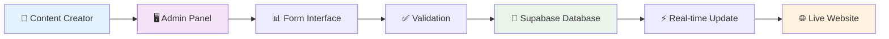
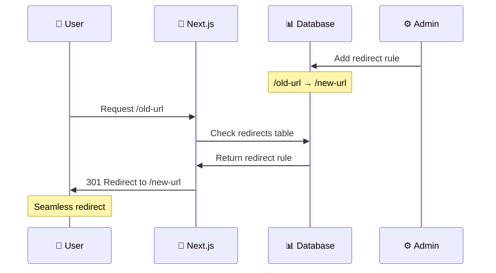
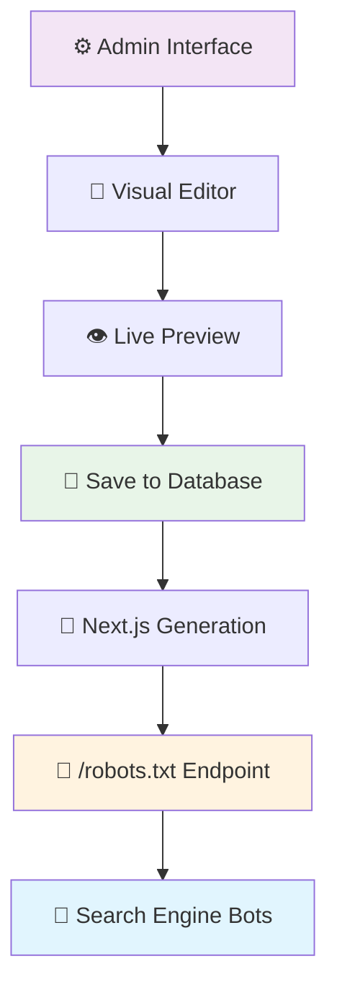
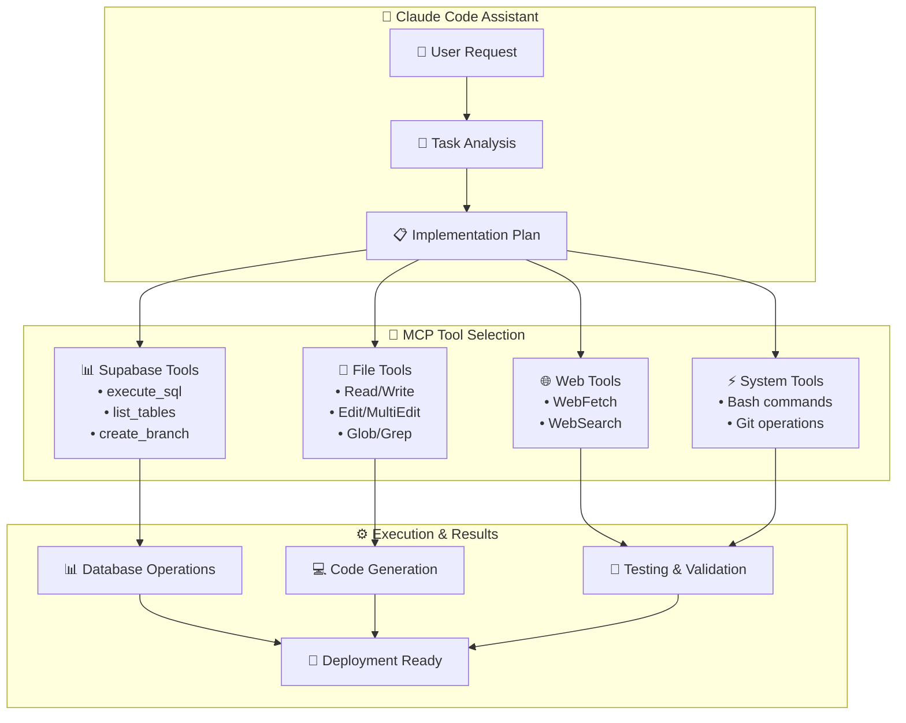
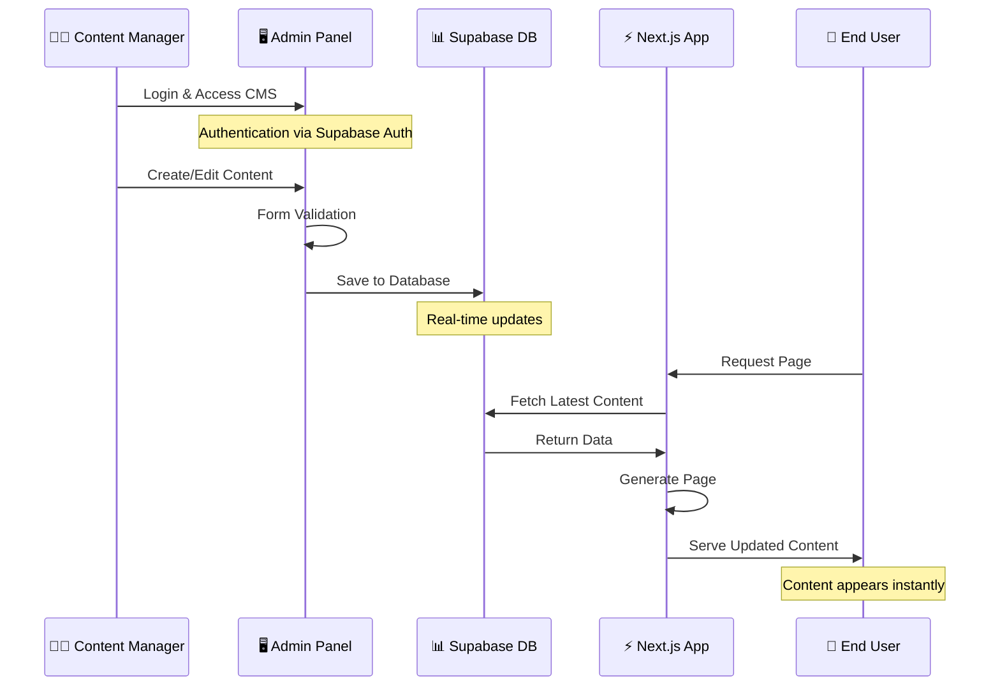
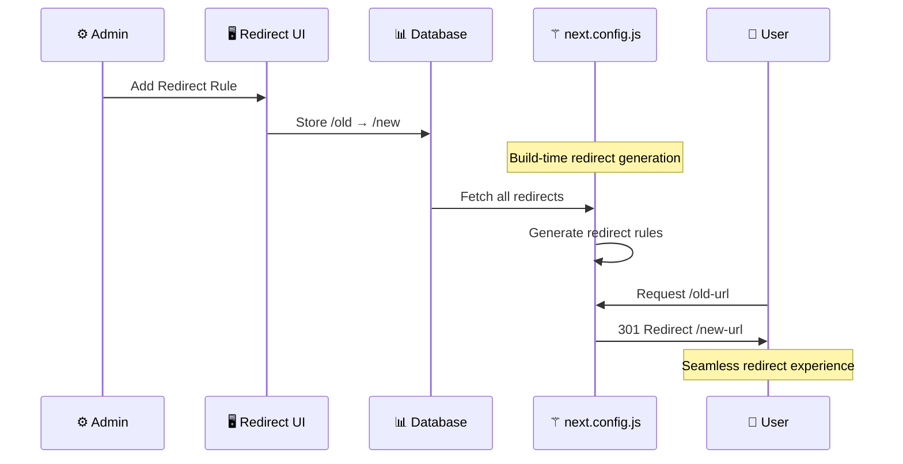

# 🏗️ TPS Site: Complete Project Architecture & Execution Flow

## 📋 Project Overview
**TPS Site** is a Next.js 15 tour booking platform with a custom-built CMS admin panel, dynamic content management, and automated redirect system. The project demonstrates modern web development practices using Supabase as the backend, Claude Code with MCP tools for development automation, and a sophisticated content management workflow.

---

## 🏛️ System Architecture Diagram

```mermaid
graph TB
    %% External Users & Systems
    subgraph "🌐 External Layer"
        USER[👤 Website Visitors]
        BOTS[🤖 Search Engine Bots]
        ADMIN[👨‍💻 Content Managers]
    end

    %% Frontend Application Layer
    subgraph "🖥️ Next.js 15 Application Layer"
        subgraph "📱 Public Site"
            HOMEPAGE[🏠 Homepage]
            TOURS[🎫 Tours Pages]
            BLOG[📖 Travel Guide]
            BOOKING[💳 Booking System]
            SEARCH[🔍 Search Results]
        end
        
        subgraph "⚙️ Admin CMS Panel"
            ADMIN_DASH[📊 Admin Dashboard]
            TOUR_MGMT[🎫 Tour Management]
            BLOG_MGMT[📝 Blog Management]
            FAQ_MGMT[❓ FAQ Management]
            REDIRECT_MGMT[🔄 URL Redirects]
            ROBOTS_MGMT[🤖 Robots.txt Manager]
            LINK_MGMT[🔗 Internal Links]
            TESTI_MGMT[💬 Testimonials]
        end
        
        subgraph "🔧 System Components"
            MIDDLEWARE[⚡ Next.js Middleware]
            ROBOTS_GEN[📄 robots.txt Generator]
            SITEMAP[🗺️ Dynamic Sitemap]
            REDIRECTS[🔄 Redirect Engine]
        end
    end

    %% Backend & Database Layer
    subgraph "🗄️ Supabase Backend"
        AUTH[🔐 Authentication]
        
        subgraph "📊 Database Tables"
            TOURS_DB[(🎫 experiences)]
            BLOG_DB[(📝 blog_posts)]
            FAQ_DB[(❓ faqs)]
            REDIRECT_DB[(🔄 slug_redirects)]
            ROBOTS_DB[(🤖 robots_config)]
            LINKS_DB[(🔗 internal_links)]
            TESTI_DB[(💬 testimonials)]
            USERS_DB[(👥 users)]
        end
        
        RLS[🛡️ Row Level Security]
        REALTIME[⚡ Real-time Updates]
    end

    %% Development & Automation Layer
    subgraph "🛠️ Development Automation (Claude Code + MCP)"
        CLAUDE[🤖 Claude Code Assistant]
        
        subgraph "🔌 MCP Tools"
            SUPABASE_MCP[📊 Supabase MCP<br/>• Execute SQL<br/>• Manage Tables<br/>• Real-time Operations]
            FILE_MCP[📁 File System MCP<br/>• Read/Write Files<br/>• Directory Operations<br/>• Code Generation]
            WEB_MCP[🌐 Web MCP<br/>• Fetch Content<br/>• API Testing<br/>• Documentation]
        end
        
        AUTO_TASKS[⚙️ Automated Tasks<br/>• Database Setup<br/>• Code Generation<br/>• Error Debugging<br/>• Feature Implementation]
    end

    %% Configuration Layer
    subgraph "⚙️ Configuration & Build"
        NEXT_CONFIG[📝 next.config.js<br/>• Dynamic Redirects<br/>• Image Optimization<br/>• Build Settings]
        
        MIDDLEWARE_CONFIG[⚡ middleware.ts<br/>• Supabase Auth<br/>• Session Management]
        
        BUILD_SYSTEM[🏗️ Build System<br/>• Static Generation<br/>• Dynamic Routes<br/>• Optimization]
    end

    %% Data Flow Connections
    USER --> HOMEPAGE
    USER --> TOURS
    USER --> BLOG
    USER --> BOOKING
    USER --> SEARCH
    
    BOTS --> ROBOTS_GEN
    BOTS --> SITEMAP
    
    ADMIN --> ADMIN_DASH
    ADMIN_DASH --> TOUR_MGMT
    ADMIN_DASH --> BLOG_MGMT
    ADMIN_DASH --> FAQ_MGMT
    ADMIN_DASH --> REDIRECT_MGMT
    ADMIN_DASH --> ROBOTS_MGMT
    ADMIN_DASH --> LINK_MGMT
    ADMIN_DASH --> TESTI_MGMT
    
    %% Database Connections
    TOUR_MGMT <--> TOURS_DB
    BLOG_MGMT <--> BLOG_DB
    FAQ_MGMT <--> FAQ_DB
    REDIRECT_MGMT <--> REDIRECT_DB
    ROBOTS_MGMT <--> ROBOTS_DB
    LINK_MGMT <--> LINKS_DB
    TESTI_MGMT <--> TESTI_DB
    
    %% Auth Flow
    ADMIN --> AUTH
    AUTH --> USERS_DB
    AUTH --> RLS
    
    %% Dynamic Generation
    REDIRECT_DB --> NEXT_CONFIG
    REDIRECT_DB --> REDIRECTS
    ROBOTS_DB --> ROBOTS_GEN
    
    TOURS_DB --> TOURS
    BLOG_DB --> BLOG
    FAQ_DB --> TOURS
    
    %% MCP Integration
    CLAUDE --> SUPABASE_MCP
    CLAUDE --> FILE_MCP
    CLAUDE --> WEB_MCP
    
    SUPABASE_MCP --> SUPABASE_BACKEND
    FILE_MCP --> NEXT_CONFIG
    FILE_MCP --> MIDDLEWARE_CONFIG
    
    AUTO_TASKS --> TOURS_DB
    AUTO_TASKS --> ROBOTS_DB
    AUTO_TASKS --> REDIRECT_DB

    %% Styling
    classDef userLayer fill:#e1f5fe,stroke:#01579b,stroke-width:2px
    classDef appLayer fill:#f3e5f5,stroke:#4a148c,stroke-width:2px
    classDef dbLayer fill:#e8f5e8,stroke:#1b5e20,stroke-width:2px
    classDef devLayer fill:#fff3e0,stroke:#e65100,stroke-width:2px
    classDef configLayer fill:#fce4ec,stroke:#880e4f,stroke-width:2px
    
    class USER,BOTS,ADMIN userLayer
    class HOMEPAGE,TOURS,BLOG,BOOKING,SEARCH,ADMIN_DASH,TOUR_MGMT,BLOG_MGMT,FAQ_MGMT,REDIRECT_MGMT,ROBOTS_MGMT,LINK_MGMT,TESTI_MGMT,MIDDLEWARE,ROBOTS_GEN,SITEMAP,REDIRECTS appLayer
    class AUTH,TOURS_DB,BLOG_DB,FAQ_DB,REDIRECT_DB,ROBOTS_DB,LINKS_DB,TESTI_DB,USERS_DB,RLS,REALTIME dbLayer
    class CLAUDE,SUPABASE_MCP,FILE_MCP,WEB_MCP,AUTO_TASKS devLayer
    class NEXT_CONFIG,MIDDLEWARE_CONFIG,BUILD_SYSTEM configLayer
```



---

## 🔄 Feature Implementation Flow

### 1. 🎯 Project Setup & Foundation
```
Claude Code + MCP Tools → Database Schema → Next.js App → Admin Panel
```

**Process:**
1. **Claude Code** analyzes requirements
2. **Supabase MCP** creates database tables
3. **File MCP** generates Next.js components
4. **Authentication** setup with Supabase
5. **Admin panel** structure creation

### 2. 🏗️ Content Management System (CMS)



**CMS Features Implemented:**
- **Tour Management**: Create, edit, delete tours with pricing, descriptions, images
- **Blog Management**: Travel guides with SEO optimization, categories, tags
- **FAQ System**: Dynamic Q&A for tours with admin management
- **URL Redirects**: Database-driven redirect management for SEO
- **Robots.txt**: Visual editor for search engine directives
- **Internal Links**: Cross-content linking system
- **Testimonials**: Customer review management

### 3. 🔄 Dynamic Redirect System



**Implementation Details:**
- **Database-driven**: All redirects stored in `slug_redirects` table
- **Build-time generation**: Next.js reads DB during build for static redirects
- **Admin managed**: Content managers add/edit redirects through UI
- **SEO friendly**: Proper 301/302 status codes
- **Content-type aware**: Supports tours, blogs, categories

### 4. 🤖 Robots.txt Management



**Key Features:**
- **Visual Management**: Add/remove paths with buttons
- **Live Preview**: See exact robots.txt output
- **Database Storage**: Persistent configuration
- **Fallback Support**: Defaults if DB unavailable
- **Instant Updates**: Changes reflect immediately

---

## 🛠️ MCP Tools Integration

### 🔌 Model Context Protocol (MCP) Usage



### 🎯 Specific MCP Tool Applications

**1. Supabase MCP Tools:**
- ✅ **Database Setup**: Created robots_config table automatically
- ✅ **Schema Management**: Table relationships and constraints
- ✅ **Data Operations**: Insert default configurations
- ✅ **Real-time Testing**: Immediate validation of changes

**2. File System MCP Tools:**
- ✅ **Component Generation**: Admin panel interfaces
- ✅ **Configuration Updates**: next.config.js modifications
- ✅ **Code Maintenance**: Middleware and routing updates
- ✅ **Multi-file Operations**: Batch edits across components

**3. Web & Testing MCP Tools:**
- ✅ **Live Testing**: Curl commands for endpoint validation
- ✅ **Documentation Fetching**: Next.js best practices
- ✅ **Real-time Debugging**: Server log analysis

---

## 📊 Data Flow Architecture

### 🔄 Content Creation to Live Site Flow



### 🔄 Redirect Management Flow



---

## 🎯 Implementation Highlights

### ✅ **Successfully Implemented Features**

**1. Database-Driven Redirects**
- ✅ Dynamic redirect rules from database
- ✅ Admin interface for management
- ✅ Build-time integration with Next.js
- ✅ SEO-friendly 301/302 redirects

**2. Robots.txt Management**
- ✅ Visual editor with live preview
- ✅ Database storage for persistence
- ✅ Instant updates without deployment
- ✅ Fallback to defaults if needed

**3. Comprehensive CMS**
- ✅ Tours, blogs, FAQs, testimonials
- ✅ Internal link management
- ✅ User authentication & authorization
- ✅ Real-time content updates

**4. Modern Architecture**
- ✅ Next.js 15 with App Router
- ✅ Supabase for backend services
- ✅ TypeScript for type safety
- ✅ Tailwind CSS for styling

### 🔧 **Technical Innovations**

**1. MCP-Powered Development**
- Automated database setup
- Real-time code generation
- Intelligent debugging assistance
- Multi-tool orchestration

**2. Build-Time Optimization**
- Dynamic redirects from database
- Static generation where possible
- Optimized image handling
- SEO-friendly metadata generation

**3. Admin-First Approach**
- Non-technical user friendly
- Visual editors for complex features
- Real-time previews
- Instant content publishing

---

## 🚀 Deployment & Production Ready

### 📦 **Production Features**
- ✅ Static generation for performance
- ✅ Image optimization
- ✅ SEO metadata management
- ✅ Search engine indexing control
- ✅ Error handling & fallbacks
- ✅ Authentication & security

### 🔄 **Maintenance & Updates**
- ✅ Admin panel for all content
- ✅ Database-driven configuration
- ✅ No code changes needed for content
- ✅ Real-time updates without deployment

---

## 📈 **Business Impact**

**For Content Managers:**
- 🎯 Easy content management without technical knowledge
- ⚡ Instant publishing capabilities
- 🔄 SEO control through redirect management
- 📊 Analytics-ready structure

**For Developers:**
- 🛠️ MCP-accelerated development
- 🏗️ Maintainable architecture
- 🔧 Automated database operations
- 📚 Self-documenting system

**For Business:**
- 💰 Reduced development time
- 📈 Better SEO management
- 🚀 Faster time to market
- 🔄 Easy content iteration

---

This architecture demonstrates how modern tools like Claude Code with MCP can accelerate development while building production-ready, maintainable systems that empower content creators and deliver excellent user experiences.